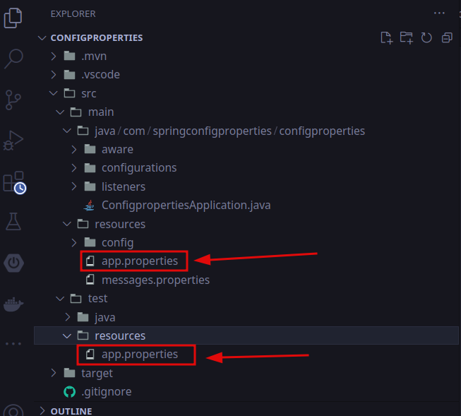
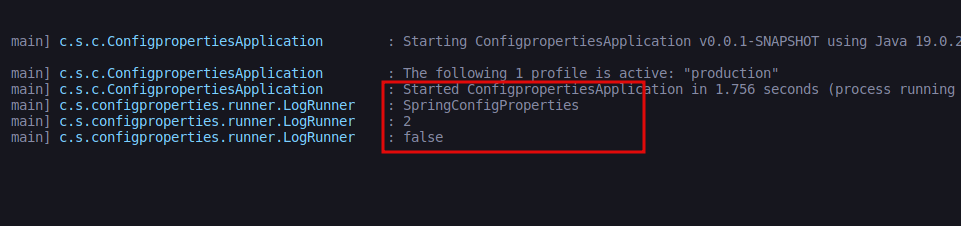

# Sebelum mempelajari, wajib memahami
  * Java IO
  * Resource bundle
  * Junit
  * SpringFramework dan SpringBoot

# Config properties
Saat kita membuat applikasi, pastinya kita akan membuat konfigurasi untuk applikasi tersebut.  
misalnya jikalau kita ingin terhubung ke DBMS kita akan membuat konfigurasi untuk database, dan sebagainya.  
Spring memiliki fitur yang namanya Sprig config properties atau Spring configuration processor.  

# Membuat Project
kita dapat membuat project spring pada [spring.io](https://start.spring.io) dan jangan lupa tambahkan dependency Lombok(Opsional) dan Spring configuration processor

# Resource
Java memiliki fitur I/O atau biasa dikenal java Input output. Java I/O biasanya digunakan untuk menejemen Resource secara low level.  
Di springBoot kita tidak perlu menggunakan java IO secara manual, springboot telah menyediakan class kusus untuk menejemen [resource](https://docs.spring.io/spring-framework/docs/current/javadoc-api/org/springframework/core/io/Resource.html) di applikasi springboot.  
Resource di springframework merupakan interface, namun untuk menggunakankan kita tidak perlu mengimplementasikanya secara manual karena sudah banyak sekali class-class implementasinya misalnya ClasspathResource.  
  
misalnya kita akan membaca resource/file yang ada pada folder resources/config/configuration.properties, maka kita bisa baca dengan cara sebagai berikut.
``` java
public class ResourceTest {

    @Test
    public void testResource() {
        ClassPathResource classPathResource = new ClassPathResource("/config/application.properties");
        Assertions.assertNotNull(classPathResource);
        Assertions.assertTrue(classPathResource.exists());
    }
}
```

# ResourceLoader
Spring memiliki fitur untuk mengambil resource secara otomatis tampa membuat object resource seperti materi sebelumnya, yaitu dengan menggunakan [ResourceLoader](https://docs.spring.io/spring-framework/docs/current/javadoc-api/org/springframework/core/io/ResourceLoader.html) dan menggunakan Method getResource(path) miliknya untuk mendapatkan object Resource. 
ResourceLoader akan mengetahui jenis resource yang kita butuhkan dari protocol path nya
|   protocol    |   deskripsi                                                               |
|---------------|---------------------------------------------------------------------------|
|   classpath:  |   mengambil resource dari class path                                      |
|   file:       |   mengambil resource dari file system(berdasarkan prefix file system)     |
|   https:      |   mengambil resource dari http/web                                        |

# ResourcLoadereAware
ResourceLoader adalah interface, sehingga jikalau kita ingin menggunakankan kita membutuhkan implementasinya.  
ApplicationContext merupakan implementasi dari ResourceLoader, sehingga kita bisa menggunakanya untuk mendapatkan Resource.  
Atau kita juga bisa mengimplementasikan interface [ResourceLoaderAware](https://docs.spring.io/spring-framework/docs/current/javadoc-api/org/springframework/context/ResourceLoaderAware.html)  
  
Misalnya kita memiliki file config.txt di folder resource/config/config.txt dan kita ingin meload nya menggunakan ResourceLoader maka kita bisa melakukan nya seperti berikut ini
``` java
package com.springconfigproperties.configproperties.aware;

import java.io.IOException;
import org.springframework.context.ResourceLoaderAware;
import org.springframework.core.io.Resource;
import org.springframework.core.io.ResourceLoader;
import org.springframework.stereotype.Component;
import lombok.Setter;

/**
 * pertama kita harus mengimplementasikan interface ResourceLoaderAware untuk mendapatkan object ResourceLoader nya
 * */
@Component
public class LoadResource implements ResourceLoaderAware {
    /**
     * properti ini akan di injection secara otomatis oleh Spring ioc menggunakan setter Injection 
     */
    @Setter
    private ResourceLoader resourceLoader;

    // method ini akan meload atau membaca file yuang config.txt yang ada pada folder project resources/config/config.txt
    public String getText() {
        Resource resource = this.resourceLoader.getResource("classpath:/config/config.txt");
        try {
            return new String(resource.getInputStream().readAllBytes());
        } catch(IOException IOX) {
            throw new RuntimeException(IOX.getMessage());
        }
    }
    
}
```

``` java
package com.springconfigproperties.configproperties;

import org.junit.jupiter.api.Assertions;
import org.junit.jupiter.api.Test;
import org.springframework.beans.factory.annotation.Autowired;
import org.springframework.boot.test.context.SpringBootTest;
import com.springconfigproperties.configproperties.aware.LoadResource;

@SpringBootTest(classes = ConfigpropertiesApplication.class)
class ConfigpropertiesApplicationTests {

	@Autowired
	public LoadResource loadResource;

	@Test
	public void testGetText() {
		String text = this.loadResource.getText();
		Assertions.assertNotNull(text);
		Assertions.assertEquals("Watashi Alliano kun", text.trim());
	}
}
```

# Mesage Resource
[MessageResource](https://docs.spring.io/spring-framework/docs/current/javadoc-api/org/springframework/context/MessageSource.html) adalah sebuh interface yang dapat kita gunakan untuk mengambil message dari resource di springframework.  
MessageSource mengkombinasikan properties dan MessageFormat, sehingga jika kita ingin melakukan internationalization tidak secara manual lagi.  

# MessageSource
[MessageResource](https://docs.spring.io/spring-framework/docs/current/javadoc-api/org/springframework/context/MessageSource.html) adalah sebuh interface, tentunya jikalau kita ingin menggunakanya kita akan membutuhkan kelas implementasinya.  
kita tidak perlui mengimplementasikan MessageResource secara manual, kita dapat memanfaatkan class implementasi nya yaitu [ResourceBundleMessageResource](httsp://dosc.spring.io/spring-framework/docs/current/javadoc-api/org/) yang telah disediakan oleh springframework.
  
Misalnya kita memiliki 2 file di resources yaitu message.properties dan message_id_ID.properties yang mana kerdua file tersebut merupakan file message yang mewakili dari dua bahasa :
  * message.properties, mewakili bahasa Inggris
  * message_id_ID.properties mewakili bahasa Indonesia
  
message.properties
``` properties
hello=Hello {0}
```

message_id_ID.properties
``` properties
hello=Hallo {0} kun
```

``` java
package com.springconfigproperties.configproperties.configurations;

import org.springframework.context.MessageSource;
import org.springframework.context.annotation.Bean;
import org.springframework.context.annotation.Configuration;
import org.springframework.context.support.ResourceBundleMessageSource;

@Configuration
public class ApplicationConfigProiperties {
    
    @Bean(name = "messageProperties1")
    public MessageSource messageSource() {
        // ResourceBundleMessageSource adalah salah satu implementasi dari MessageSource
        ResourceBundleMessageSource resourceBundleMessageSource = new ResourceBundleMessageSource();
        /**
         * ini kita sesuaikan dengan nama file properties di folder resource, dalam kasus ini nama file nya adalah message
         * kita tidak perlu menyebutkan extensi dan conuntry region nya misalnya message.properties atau message_id_ID.properties
         * */
        resourceBundleMessageSource.setBasenames("config/message");
        return resourceBundleMessageSource;
    }
}
```

``` java
package com.springconfigproperties.configproperties;

import java.util.Locale;
import org.junit.jupiter.api.Assertions;
import org.junit.jupiter.api.Test;
import org.springframework.beans.factory.annotation.Autowired;
import org.springframework.boot.test.context.SpringBootTest;
import org.springframework.beans.factory.annotation.Qualifier;
import org.springframework.context.MessageSource;

@SpringBootTest(classes = ConfigpropertiesApplication.class)
public class MessageSourceTest {
    
    @Autowired @Qualifier(value = "messageSource1")
    public MessageSource messageSource;

    @Test
	public void testMessageSourceEn() {
		String message = this.messageSource.getMessage("hello", new Object[]{"Alliano"}, Locale.ENGLISH);
		Assertions.assertEquals("Hello Alliano", message);
	}

	@Test
	public void testMessageSourceInID() {
		String message_id_ID = this.messageSource.getMessage("hello", new Object[]{"Alliano"}, new Locale
																										.Builder()
																										.setRegion("ID")
																										.setLanguage("id")
																										.build());
		Assertions.assertEquals("Hallo Alliano kun", message_id_ID);
	}
}
```

# SpringBoot MessageSoruce
Saat kita menggunakan SpringBoot, by default springBoot telah menyediakan Bean MessageSource jadi kita tidak perlu membuatkanya secara manual seperti yang kita lakukan diatas.  
Bean MessageSource yang disediakan spring akan membaca file messages.properties di folder resource prject kita.  

# MessageSourceAware
jika kita ingin menggunakan Bean MessageSource yang disediakan oleh Spring, kita bisa mengimplementasikan interface [MessageSourceAware](https:docs.spring.io/spring-framework/docs/current/javadoc-api/org/springframework/context/MessageSourceAware.html) dengan bagitu kita akan mendapatkan Bean MessageSource yang telah dibuatkan oleh spring secara ototmatis.  

misalnya disini saya memiliki resource bundle dengan nama messages.properties(nama nya wajib messages karna telah di standarisasi oleh spring nya), nantinya resource ini(file ini) akan dibaca oleh Bean MessageSource yang disediakan otomatis oleh spring.
``` properties
sampleMessage=Hello {0}, goodafternoon
```

``` java
package com.springconfigproperties.configproperties.configurations;

import java.util.Locale;

import org.springframework.beans.factory.annotation.Qualifier;
import org.springframework.context.MessageSource;
import org.springframework.context.MessageSourceAware;
import org.springframework.stereotype.Component;

@Component
public class SampleSource implements MessageSourceAware {

    private MessageSource messageSource;
    
    public String greeting(Locale locale) {
        return this.messageSource.getMessage("sampleMessage", new Object[]{"Alliano"}, locale);
    }

    /**
     * disini kita gunakan @Qualifier untuk memilih bean dengan nama messageSource di spring IOC nya
     * */
    @Override 
    public void setMessageSource(@Qualifier(value = "messageSource")MessageSource messageSource) {
        this.messageSource = messageSource;
    }
}
```

``` java
package com.springconfigproperties.configproperties;

import java.util.Locale;
import org.junit.jupiter.api.Assertions;
import org.junit.jupiter.api.Test;
import org.springframework.beans.factory.annotation.Autowired;
import org.springframework.boot.test.context.SpringBootTest;
import com.springconfigproperties.configproperties.configurations.SampleSource;

@SpringBootTest(classes = ConfigpropertiesApplication.class)
public class MessageSourceAwareTest {
    
    @Autowired
    public SampleSource sampleSource;

    @Test
    public void testsampleMessage() {
        String greeting = sampleSource.greeting(Locale.getDefault());
        Assertions.assertEquals("Hello Alliano, good afternoon", greeting);
    }
}
```

# application.properties
Didalam project spring kita terdapat folder yang bernama resources dan didalam resources tersebut secara defaut terdapat file application.properties  
File application.properties adalah pusat dari konfigurasi yang akan kita buat pada applikasi spring kita, misalnya konfigurasi :
 * database
 * database pool
 * nama applikasi 
 * port applikasi
 * dan sebagainya, masih banyak
  
Saat Aplikasi sprig kita dijalankan maka secara otomatis file application.properties akan di load atau dibaca oleh applikasi spring kita dan konfigurasinya akan digunakan.  
Untuk mengakses application.properties sebenarnya ada banyak cara, misalnya dengan cara mengimplementasikan interface EnvironmentAware atau kita dapat langsung meng inject Environment menggunakan @Autowired annotation
  
Misalnya disini kita memiliki file appliaction.properties yang isinya 
``` properties
spring.application.name=SpringConfigProperties
```
Dan kita dapat mengaksesnya dengan cara sebagai berikut 
``` java
package com.springconfigproperties.configproperties;

import org.junit.jupiter.api.Assertions;
import org.junit.jupiter.api.Test;
import org.springframework.beans.factory.annotation.Autowired;
import org.springframework.boot.test.context.SpringBootTest;
import org.springframework.core.env.Environment;

@SpringBootTest(classes = ConfigpropertiesApplication.class)
public class ApplicationPropertiesTest {
    /**
     * Spring ioc akan menginject property Environtment dnegan 
     * Object bean Environtment yang terlah disediakan oleh 
     * Spring ioc, tentunya didalam environtment nya akan
     * memuat konfigurasi yang terdapat pada application.properties
     */
    @Autowired
    public Environment environment;

    @Test
    public void testApplicationProperties() {
        String property = this.environment.getProperty("spring.application.name");
        Assertions.assertEquals("SpringConfigProperties", property);
    }
}
```

# Environment
Pada pembahasan diatas kita telah memanfaatkan Environment untuk mengakses konfigurasi yang ada pada application.properties  
[Environment](https://docs.spring.io/spring-framework/docs/current/javadoc-api/org/springframework/env/Emvironment.html) dapat kita gunakan untuk mengambil env variabel yang ada di Sistem operasi kita, misalnya seperti :
 * JAVA_HOME
 * USER
 * dan sebagainya, masih banyak

Untuk menggunakan Environment kita bisa langsung menginject menggunakan @Autowired seperti yang kita telah praktikan di materi sebelumnya, namun untuk bestpractice nya atau jikalau kita ingin mengikuiti standar programming nya kita bisa mengimplementasikan interface EnvironmentAware.

``` java
package com.springconfigproperties.configproperties.aware;

import org.springframework.context.EnvironmentAware;
import org.springframework.core.env.Environment;
import org.springframework.stereotype.Component;
import lombok.Getter;

@Component
public class EnvironmentSystem implements EnvironmentAware {

    @Getter
    private Environment environment;

    @Override
    public void setEnvironment(Environment environment) {
        this.environment = environment;
    }
}
```

``` java
package com.springconfigproperties.configproperties;

import org.junit.jupiter.api.Assertions;
import org.junit.jupiter.api.Test;
import org.springframework.beans.factory.annotation.Autowired;
import org.springframework.boot.test.context.SpringBootTest;
import org.springframework.core.env.Environment;
import com.springconfigproperties.configproperties.aware.EnvironmentSystem;

@SpringBootTest(classes = ConfigpropertiesApplication.class)
public class EnvirontmentTest {
    
    @Autowired
    public EnvironmentSystem environmentSystem;

    @Test
    public void testEnvirontment() {
        Environment environment = this.environmentSystem.getEnvironment();
        // mislanya disini kita ingin mengetahui user dari komputer kita
        String property = environment.getProperty("USER");
        Assertions.assertEquals("alliano-dev", property);
    }
}
```

# @Value
[Value](https://docs.spring.io/spring-framework/docs/current/javadoc-api/org/springframework/beans/factory/annotation/Value.html) annotation adalah annotation yang dapat kita gunakan untuk meng inject properti/field dengan value yang ada didalam application.properties  
Cara penggunaanya cukup mudah, kita hanya perlu meng annotasi field atau property dengan annotation @Value(value = "${key.properties.nya}")  
dengan begitu spring akan mengambil data sesuai dengan key yang ada didalam application.properties dan mengkonfersi data nya sesuai dengan tipe data pada file nya.  
  
Misalnya kita memiliki beberapa key didalam application.properties
``` properties
spring.application.name=SpringConfigProperties
spring.application.version=2
spring.application.production-mode=false
```

``` java
package com.springconfigproperties.configproperties.configurations;

import org.springframework.beans.factory.annotation.Value;
import org.springframework.stereotype.Component;
import lombok.Getter;

@Getter
@Component(value = "applicationInfo")
public class ApplicationInfo {
    
    @Value(value = "${spring.application.name}")
    private String name;

    @Value(value = "${spring.application.version}")
    private int version;

    @Value(value = "${spring.application.production-mode}")
    private boolean producton;

    /**
     * kita juga dapat mengambil env variabel didalam sistem operasi kita
     * misalnya, kita ingin mengambil user dari komputer kita
     */
    @Value(value = "${USER}")
    private String userAdmin;
}
```

``` java
package com.springconfigproperties.configproperties;

import org.junit.jupiter.api.Assertions;
import org.junit.jupiter.api.Test;
import org.springframework.beans.factory.annotation.Autowired;
import org.springframework.boot.test.context.SpringBootTest;
import com.springconfigproperties.configproperties.configurations.ApplicationInfo;

@SpringBootTest(classes = ConfigpropertiesApplication.class)
public class TestValueAnnotation {

    @Autowired
    public ApplicationInfo applicationInfo;

    @Test
    public void testApplicationInfo() {
        String name = this.applicationInfo.getName();
        String userAdmin = this.applicationInfo.getUserAdmin();
        int version = this.applicationInfo.getVersion();
        boolean production = this.applicationInfo.getProduction();
        
        Assertions.assertEquals("SpringConfigProperties", name);
        Assertions.assertEquals("alliano-dev", userAdmin);
        Assertions.assertEquals(2, version);
        Assertions.assertFalse(production);
    }
}
```

# PropertySource
Di pembahasan sebelumnya kita telah mengetahui bahwa application.properties secara otomatis di load atau di baca saat applikasi spring kita dijalankan, namun bagaimana jikalau kita memiliki resource dengan nama selain application.properties ?  
tentunya secara default saat spring dijalankan resource tersebut tidak akan di load atau dibaca oleh spring.  
jika kita ingin resource tersebut(nama resource yang selain application.properties) dibaca atau di load maka kita harus mebuat class configuration dan di annotation dengan [@PropertySource](https://docs.spring.io/spring-framework/docs/current/javadoc-api/org/springframework/context/annotation/PropertySource.html), jika kita memiliki banyak resources maka kita bisa kombinasikan dengan @propertySources.  
  
Misalnya disinisaya memiliki resource dengan naman app.properties, tentunya saat application pertama kali dijalankan resource tersebut tidak di load

``` properties
example.version=1
example.name=SpringBoot
```

Agar resource tersebut di load ketika applikasi dijalankan, maka kita dapat membuat class configuration seperti berikut ini
``` java
package com.springconfigproperties.configproperties.configurations;

import org.springframework.beans.factory.annotation.Value;
import org.springframework.context.annotation.Configuration;
import org.springframework.context.annotation.PropertySource;
import org.springframework.context.annotation.PropertySources;
import lombok.Getter;

/**
 * jika kita memiliki lebih dari 1 resource yang ingin di load,
 * maka kita bisa mengkombinasikan @PropertySources dengan @PropertySource
 */
@PropertySources(value = {
    @PropertySource(value = { "classpath:/app.properties"})
})
@Getter @Configuration
public class PropertySourcesConfiguration {
    
    @Value(value = "${example.version}")
    private int version;

    @Value(value = "${example.name}")
    private String name;
}
```

``` java
package com.springconfigproperties.configproperties;

import org.junit.jupiter.api.Assertions;
import org.junit.jupiter.api.Test;
import org.springframework.beans.factory.annotation.Autowired;
import org.springframework.boot.test.context.SpringBootTest;
import org.springframework.core.env.Environment;
import com.springconfigproperties.configproperties.configurations.PropertySourcesConfiguration;

@SpringBootTest(classes = ConfigpropertiesApplication.class)
public class PropertysourceTest {
    
    @Autowired
    public PropertySourcesConfiguration proiperties;

    @Autowired
    public Environment environment;

    @Test
    public void testPropertySource() {
        String name = this.proiperties.getName();
        int version = this.proiperties.getVersion();
        String property1 = this.environment.getProperty("example.version");
        String property2 = this.environment.getProperty("example.name");
        Assertions.assertNotNull(name);
        Assertions.assertNotNull(version);
        Assertions.assertNotNull(property1);
        Assertions.assertNotNull(property2);
        Assertions.assertSame(Integer.parseInt(property1), version);
        Assertions.assertEquals(property2, name);
    }
}
```

# TestPropertySource
Saat kita melakukan unit test pada applikasi spring kita, terkadang kita akan membuat sekenario yang mana applikasi kita akan meload atau membaca file konfigurasi kusus untuk unit test.  
Dengan menggunakan annotation @PropertySource atau @PropertySources kasus tersebut terselesaikan, namun lumayan ribet karena kita harus membuat class konfigurasi kusus untuk unit test dan di annotasi dengan @PropertySource.  
  
SpringBoot memiliki annotasi @TestPropertySource dan @TestPropertySources untuk mempermudah kasus seperti diatas.
Untuk menggunakan @TestPropertySource Kita wajib membuat folder resources didalam folder test, dan dialam folder resource kita buat file dengan nama yang sama dengan file properties yang inign kita test.  


  
berikut ini adalah isi dari app.properties
``` properties
example.version=2
example.name=spring-properties-test
```
``` java
package com.springconfigproperties.configproperties;

import org.junit.jupiter.api.Assertions;
import org.junit.jupiter.api.Test;
import org.springframework.beans.factory.annotation.Autowired;
import org.springframework.boot.test.context.SpringBootTest;
import org.springframework.test.context.TestPropertySources;
import com.springconfigproperties.configproperties.configurations.PropertySourcesConfiguration;
import org.springframework.test.context.TestPropertySource;

@TestPropertySources(value = {
    // disini kita cukup sebutkan nama konfigurasi untuk unit tesnya
    // yang ada didalam folder test/resource,
    // dalam kasus disini nama nya app.properties 
    @TestPropertySource("classpath:/app.properties")
})
@SpringBootTest(classes = ConfigpropertiesApplication.class)
public class TestPropertySourceAnnotaton {
    
    @Autowired
    public PropertySourcesConfiguration property;

    @Test
    public void testPropery() {
        String name = this.property.getName();
        int version = this.property.getVersion();
        Assertions.assertSame(2, version);
        Assertions.assertEquals("spring-properties-test", name);
    }   
}
```

# @Profile
Saat pengembangan applikasi, secara umum akan terbagi beberapa proses yaitu development, testing, dan production.  
Ada kalanya kita ingin menentukan sebuah konfigurasi tertentu saat applikasi berjalan misalnya saat production :
 * Terhubung dengan database yang ada pada cloud
 * Membuat bean tertentu
 * dan sebagainnya

Atau pada saat development :
 * Terhubung dengan database local
 * dan sebagainya

Hal tersebut dapat kita lakukan dengan menggunakan @Profile pada class level, dengan begitu maka komponen atau konfigurasi akan di load sesuai dengan profile yang aktif.  

Misalnya kita akan membuat bean tertentu ketika production
``` java
package com.springconfigproperties.configproperties.configurations;

import org.springframework.context.annotation.Profile;
import org.springframework.stereotype.Component;
import com.springconfigproperties.configproperties.utils.Greeting;

/**
 * bean ini akan dibuat dan digunakan ketika
 * profile active nya production,
 * kalo profile active nya bukan production
 * maka bean ini tidak akan pernah dbuat
 */
@Profile(value = {"production"})
@Component
public class GreetingInProduction implements Greeting {

    @Override
    public String greet() {
       return "Hello from production profile";
    }
}
```

Untuk menentukan profile apa yang aktif kita dapat mengkonfigurasinya pada file application.properties
``` properties
# berikut ini adalah cara mengkonfigurasi profile yang aktif, 
# jikalau kita ingin beberapa profile yang aktif kita bisa tambahkan ,dan dilanjut dengan nama profile
# spring.profiles.active=production, development, test

spring.profiles.active=production
```

``` java
package com.springconfigproperties.configproperties;

import org.junit.jupiter.api.Assertions;
import org.junit.jupiter.api.Test;
import org.springframework.beans.factory.annotation.Autowired;
import org.springframework.boot.test.context.SpringBootTest;
import com.springconfigproperties.configproperties.configurations.GreetingInProduction;

@SpringBootTest(classes = ConfigpropertiesApplication.class)
public class ProfileTest {
    
    @Autowired
    public GreetingInProduction production;

    @Test
    public void testGreetingInProduction() {
        String greet = this.production.greet();
        Assertions.assertNotNull(greet);
        Assertions.assertEquals("Hello from production profile", greet);
    }
}
```

# @ActiveProfiles
Saat kita membuat Unit test, terkadang kita seringkali mengubah profiles active di application.properties untuk menguji sebuah bean atau konfigurasi yang di jalankan di profiles tertentu, misalnya di production atau development.  
Hal tersebut cukuplah ribet, daripada kita berulang-ulang kali mengubah profiles active di application.properties, lebih baik kita menggunakan annotation @ActiveProfiles()  
Dengan menggnakan annotation @ActiveProfiles spring akan meng overide value dari profile active dengan value yang kita berikan di annotasi @ActiveProfiles (overide value tersebut berlaku di kelas yang di annotasi saja)

Misalnya di application.properties kita mengaktifkan profile 
``` properties
spring.profiles.active=test
```
Tentunya saat proses testing bean atau konfigurasi yang memiliki profiles selain test tidak akan dijalankan, namun jikalau kita menggunakan annotation @ActiveProfiles pada class configuration, atau class component, atau class unit test, maka spring akan mengubah profiles active nya sesuai dnegan value yang diberikan di annotion @ActiveProfiles
``` java
package com.springconfigproperties.configproperties;

import org.junit.jupiter.api.Assertions;
import org.junit.jupiter.api.Test;
import org.springframework.beans.factory.annotation.Autowired;
import org.springframework.boot.test.context.SpringBootTest;
import org.springframework.core.env.Environment;
import org.springframework.test.context.ActiveProfiles;
import com.springconfigproperties.configproperties.configurations.GreetingInProduction;

/**
 * Dengan menggunakan annotation @ActiveProfiles, unit test ini
 * tidak akan menghiraukan profile apa yang diaktifkan di application.properties
 * melainkan spring akan mengoveride profiles yang di seting di application.properties
 * dengan value yang diberikan di annotations @ActiveProfiles
 */
@ActiveProfiles(profiles = {"production", "development"})
@SpringBootTest(classes = ConfigpropertiesApplication.class)
public class ActiveProfilesTest {

    @Autowired
    private GreetingInProduction production;

    /**
     * kita juga dapat memanfaatkan Environment atau EnvironmentAware 
     * untuk mendapatkan profile apa yang sedang aktif sekarang
     */
    @Autowired
    private Environment environment;
    
    @Test
    public void testProduction() {
        String greet = this.production.greet();
        Assertions.assertEquals("Hello from production profile", greet);
        String[] activeProfiles = this.environment.getActiveProfiles();
        Assertions.assertArrayEquals(new String[]{"production", "development"}, activeProfiles);
    }
}
```

<!-- # Properties profile naming -->

# @ConfigurationProperties
Sebelumnya kita telah mempelajari cara mengambil data dari resource atau dari application.properties menggunakan beberapa cara, yaitu dengan menggunakan :
 * EnvironmentAware
 * Environment
 * @Value

SpringBoot memiliki fitur yang labih canggih untuk melakukan hal tersebut, yaitu annotation [@ConfigurationProperties](https://docs.spring.io/spring-boot/docs/current/api/org/springframework/boot/context/properties/ConfigurationProperties.html)  
@ConfigurationProperties ini dapat melakukan binding key yang ada di application.properties kedalam object bean secara otomatis.  
Untuk menggunakan fitur tersebut kita harus menambahkan dependency berikut ini 
``` xml
<dependency>
	<groupId>org.springframework.boot</groupId>
	<artifactId>spring-boot-configuration-processor</artifactId>
	<scope>runtime</scope>
</dependency>
```

Langkah pertama untuk menggunakan fitur tersebut, kita harus membuat class yang akan di binding dengan key di application.properties  
Setelah itu kita annotasi class tersebut dengan @ConfigurationProperties dan kita berikan prefix = application (nama prefix nya bebas) dan jangan lupa berikan annotasi @Setter dan @Getter  
@Setter dan @Getter akan digunakan oleh sring container untuk meng inject property yang ada didalam class
``` java
package com.springconfigproperties.configproperties.properties;

import org.springframework.boot.context.properties.ConfigurationProperties;
import lombok.Getter;
import lombok.Setter;

/**
 * pada class ini kita tidak perlu memberi annotasi dengan
 * @Configuration ataupun @Component
 * karena class ini akan di jadikan bean secara otomatis
 * oleh spring container ioc
 * */
@Setter @Getter
@ConfigurationProperties(prefix = "application")
public class ApplicationConfigurationProperties {
    
    private String name;

    private Integer version;

    private boolean productionMode;
}
```

Langkah selanjutnya, kita dapat langsung menggunakan pada application.properties

``` properties
# application merupakan prefix yang kita definisikan pada class ApplicationConfigurationProperties, 
# yang mana prefix tersebut akan digunakan oleh spring ioc untuk melakukan binding/injection kepada
# property yang dimiliki class tersebut

# name, version, dan priduction-mode adalah propery yang dimiliki oleh class ApplicationConfigurationProperties yang kita annotasi 
# dengan @ConfigurationProperties, properti-property tersebut akan di inject oleh spring container ioc menggunakan 
# method seter dan getter, maka dari itu wajib membuatkan setter dan getter pada class tersebut

application.name=SpringConfigProperties
application.version=2
application.production-mode=false
```

Setelah itu kita perlu meng enable atau mengaktifkan konfigurasi yang kita buat dengan annotasi [@EnableConfigurationProperties](https://docs.spring.io/spring-boot/docs/current/api/org/springframework/boot/context/properties/EnableConfigurationProperties.html) pada main class dan kita sebutkan class yang kita annotasi dengan @ConfigurationProperties

``` java
package com.springconfigproperties.configproperties;

import org.springframework.boot.SpringApplication;
import org.springframework.boot.autoconfigure.SpringBootApplication;
import org.springframework.boot.context.properties.EnableConfigurationProperties;
import com.springconfigproperties.configproperties.properties.ApplicationConfigurationProperties;

@EnableConfigurationProperties(value = {
	ApplicationConfigurationProperties.class
})
@SpringBootApplication
public class ConfigpropertiesApplication {

	public static void main(String[] args) {
		SpringApplication.run(ConfigpropertiesApplication.class, args);
	}

}
```
Dengan menggunakan cara ini, jikalau kita ingin mengambil value dari application properties kita tidak perlu lagi menggunakan annotation @Value atau mengambil dari Environment, kita cukup meng inject class yang di annotasi @ConfigurationPoperties dan siap dugunakan.  

# Nested ConfigurationProperties
ConfigurationProperties mendukung nested configuration, misalnya konfiguration yang memuat bean konfiguration lain.  
Hal tersbut sangat mempermudah kita sebagai programmer karena tidak perlu lagi melakukan configuration secra manual menggunakan @Value annotation dan sebagainya.  


Misalnya kita memiliki konfigurasi Applikasi dan didalam konfigurasi applikasi tersebut memuat konfigurasi untuk messaging 
``` java
package com.springconfigproperties.configproperties.properties;

import lombok.Getter;
import lombok.Setter;

@Setter @Getter
public class MessageBroker {
 
    private String driver;

    private String username;

    private String password;

    private String name;

    private String url;
}
```

``` java
package com.springconfigproperties.configproperties.properties;

import org.springframework.boot.context.properties.ConfigurationProperties;
import lombok.Getter;
import lombok.Setter;

@Setter @Getter
@ConfigurationProperties(prefix = "application")
public class ApplicationConfigurationProperties {
    
    private String name;

    private Integer version;

    private boolean productionMode;

    /**
     * dengan begini, kita telah melakukan nested configuration
     * yang mana didalam class configuration ini memuat class configuration
     * lain yaitu messageBroker
     * */
    private MessageBroker messageBroker;
}
```

Maka cara penggunaanya sebagai berikut

``` properties
application.message-broker.name=kafka
application.message-broker.driver=kafka.com.cj.driver
application.message-broker.url=https://url-kafka.com
application.message-broker.password=secretPass
application.message-broker.username=alliano
```

Dan sekarang kita dapat mengujinya
``` java
package com.springconfigproperties.configproperties;

import org.junit.jupiter.api.Assertions;
import org.junit.jupiter.api.Test;
import org.springframework.beans.factory.annotation.Autowired;
import org.springframework.boot.test.context.SpringBootTest;
import com.springconfigproperties.configproperties.properties.ApplicationConfigurationProperties;

@SpringBootTest(classes = ConfigpropertiesApplication.class)
public class NestedConfigurationPropertiesTest {
    
    @Autowired
    private ApplicationConfigurationProperties proiperties;

    @Test
    public void testNestedProperties() {
        String name = this.proiperties.getMessageBroker().getName();
        String driver = this.proiperties.getMessageBroker().getDriver();
        String url = this.proiperties.getMessageBroker().getUrl();
        String username = this.proiperties.getMessageBroker().getUsername();
        String password = this.proiperties.getMessageBroker().getPassword();
        Assertions.assertArrayEquals(
            new String[]{"kafka", "kafka.com.cj.driver", "https://url-kafka.com", "alliano", "secretPass"}, 
            new String[]{name, driver, url, username, password});
    }
}
```

# Collection ConfigurationProperties
@ConfigurationProperties juga mendukung binding properties ke tipedata collection, misalnya seperti :
 * List\<T>
 * Map\<K, V>
Hal tersebut sangat membantu jikalau kita memiliki konfigurasi yang sangat kompleks dan kita membutuhkan struktur data collection untuk menyimpan konfigurasi tersebut.  
  
Misalnya kita memiliki kasus yang mana kita akan terkoneksi dengan 2 database dan kita ingin mengkonfigurasi kedua database tersebut, untuk kasus tersebut kita bisa menggunakan tipe data List\<T> untuk membuat konfigurasinya

``` java
package com.springconfigproperties.configproperties.properties;

import lombok.Getter;
import lombok.Setter;

@Setter @Getter
public class DatabaseServer {
    
    private String username;

    private String name;

    private String password;

    private String url;

    private String driver;
}
```
Disini kita bisa menambahkan 1 property dengan tipe data List\<T>, yang mana property tersebut akan menampung semua konfigurasi database
``` java
package com.springconfigproperties.configproperties.properties;

import java.util.List;
import java.util.Map;
import org.springframework.boot.context.properties.ConfigurationProperties;
import lombok.Getter;
import lombok.Setter;

@Setter @Getter
@ConfigurationProperties(prefix = "application")
public class ApplicationConfigurationProperties {
    
    private String name;

    private Integer version;

    private boolean productionMode;

    private List<DatabaseServer> databaseServers; // ConfigurationProperties collction List

    private MessageBroker messageBroker;
}
```
Untuk menggunakanya di application.properties cukuplah mudah, kita cukup menyebutkan prefixnya dan diikuti dengan [] untuk menentukan nilai tersebut akan disimpan pada index ke berapa
``` properties
# List configuration

# Tanda [] ini digunakan untuk menentukan nilai ini nanti disimpan pada List index ke berapa 
application.database-servers[0].name=Postgresql
application.database-servers[0].driver=com.cj.jdbc.Driver
application.database-servers[0].url=jdbc:postgres://192.168.0.1:5432
application.database-servers[0].username=alliano-dev
application.database-servers[0].password=secretPassword

application.database-servers[1].name=Mysql
application.database-servers[1].driver=mysql.cj.jdbc.Driver
application.database-servers[1].url=jdbc:mysql://192.168.0.1:5432
application.database-servers[1].username=alliano-dev
application.database-servers[1].password=secretPassword
```

``` java
package com.springconfigproperties.configproperties;

import org.junit.jupiter.api.Assertions;
import org.junit.jupiter.api.Test;
import org.springframework.beans.factory.annotation.Autowired;
import org.springframework.boot.test.context.SpringBootTest;
import com.springconfigproperties.configproperties.properties.ApplicationConfigurationProperties;
import com.springconfigproperties.configproperties.properties.DatabaseServer;

@SpringBootTest(classes = ConfigpropertiesApplication.class)
public class CollectionConfigurationPropertiesTest {

    @Autowired
    private ApplicationConfigurationProperties properties;

    @Test
    public void testConfigList() {
        DatabaseServer databaseServer1 = this.properties.getDatabaseServers().get(0);
        DatabaseServer databaseServer2 = this.properties.getDatabaseServers().get(1);

        Assertions.assertNotNull(databaseServer1);
        Assertions.assertNotNull(databaseServer2);

        Assertions.assertArrayEquals(
            new String[]{"Postgresql", "com.cj.jdbc.Driver", "jdbc:postgres://192.168.0.1:5432", "alliano-dev", "secretPassword"}, 
            new String[]{databaseServer1.getName(), databaseServer1.getDriver(), databaseServer1.getUrl(), databaseServer1.getUsername(), databaseServer1.getPassword()});
        
        Assertions.assertArrayEquals(
            new String[]{"Mysql", "mysql.cj.jdbc.Driver", "jdbc:mysql://192.168.0.1:5432", "alliano-dev", "secretPassword"}, 
            new String[]{databaseServer2.getName(), databaseServer2.getDriver(), databaseServer2.getUrl(), databaseServer2.getUsername(), databaseServer1.getPassword()});
        
    }
}
```
  
kita bisa juga menggunakan tipe data Map\<K, V>, contohnya seperti berikut ini
``` java
import lombok.Setter;

@Setter @Getter
public class ServerProperties {
    
    private String host;

    private int port;
}
```

``` java
package com.springconfigproperties.configproperties.properties;

import java.util.List;
import java.util.Map;
import org.springframework.boot.context.properties.ConfigurationProperties;
import lombok.Getter;
import lombok.Setter;

@Setter @Getter
@ConfigurationProperties(prefix = "application")
public class ApplicationConfigurationProperties {
    
    private String name;

    private Integer version;

    private boolean productionMode;

    private Map<String, ServerProperties> serverProperties; // configurationProperties collection map

    private List<DatabaseServer> databaseServers;

    private MessageBroker messageBroker;
}
```

``` properties
# map configuration

# Penggunaan nya cukup mudah, mirip seperti menggunakan List.
# Namun kita perlu menentukan Key dan value nya
# server1 merupakan key setelah itu diikuti dengan property nya dan setelah itu baru bisa memasukan value nya
application.server-properties.server1.host=https://server-configration.net
application.server-properties.server1.port=9072

application.server-properties.server2.host=https://main-server-configuration.net
application.server-properties.server2.port=9073
```

``` java
package com.springconfigproperties.configproperties;

import org.junit.jupiter.api.Assertions;
import org.junit.jupiter.api.Test;
import org.springframework.beans.factory.annotation.Autowired;
import org.springframework.boot.test.context.SpringBootTest;
import com.springconfigproperties.configproperties.properties.ApplicationConfigurationProperties;
import com.springconfigproperties.configproperties.properties.ServerProperties;

@SpringBootTest(classes = ConfigpropertiesApplication.class)
public class CollectionConfigurationPropertiesTest {

    @Autowired
    private ApplicationConfigurationProperties properties;

    @Test
    public void testConfigMap() {
        ServerProperties serverProperties1 = this.properties.getServerProperties().get("server1");
        ServerProperties serverProperties2 = this.properties.getServerProperties().get("server2");

        Assertions.assertArrayEquals(
            new Object[]{"https://server-configration.net", 9072},
            new Object[]{serverProperties1.getHost(), serverProperties1.getPort()});
        
            Assertions.assertArrayEquals(
            new Object[]{"https://main-server-configuration.net", 9073},
            new Object[]{serverProperties2.getHost(), serverProperties2.getPort()});
    }
}
```

# Conversion
Sejauh ini, pasti muncul pertanyaan bagaimana config properties di spring bisa mengkonversi secara otomatis menjadi tipe data yang ada di pemograman java misalnya :
 * List\<T>
 * Map\<K, V>
 * String
 * Number
 * Boolean
 * Duration
 * dan lain-lain
  
SpringFramework memiliki mekanisme konversi tipedata secara otomatis dengan menggunakan interface [Converter<S, T>](https://docs.spring.io/spring-framework/docs/current/javadoc-api/org/springframework/core/convert/converter/Converter.html), interface Converter memiliki banyak class implementasinya sehingga kita tidak perlu mengimplementasikanya secara manual, terkecuali jikalau class-class impelemtasi tersebut tidak memenuhi kebutuhan kita, maka kita bisa mengimplementasikan interface Converter\<S, T>  
  
Misalnya disini kita memiliki kasus yang mana kita ingin membuat converter untuk tipe data String ke Date, maka kita bisa mengimplementasikan nya.
``` java
package com.springconfigproperties.configproperties.converters;

import java.text.SimpleDateFormat;
import java.util.Date;
import org.springframework.core.convert.converter.Converter;
import org.springframework.stereotype.Component;
import lombok.SneakyThrows;

@Component
public class StringToDateConverter implements Converter<String, Date> {

    private final SimpleDateFormat DATE_FORMAT = new SimpleDateFormat("yyyy-mm-dd");
    
    @Override @SneakyThrows
    public Date convert(String source) {
        return DATE_FORMAT.parse(source);
    }
    
}
```
  
Setelah itu, ada satu hal yang wajib kita lakukan setelah membuat custom converter, yaitu meregistrasikan custom converter kita menggunakan [ConversionService](https://docs.spring.io/spring-framework/docs/current/javadoc-api/org/springframework/core/convert/ConversionService.html), ConversionServce merupakan interface dan untuk menggunakanya tentunya kita membutuhkan class impelemntasinya, namun kita tidak perlu membuat class implementasinya secara manual, kita bisa memanfaatkan class implementasi dari ConverterService yaitu [ApplicationConveterService](https://docs.spring.io/spring-boot/docs/current/api/org/springframework/boot/convert/ApplicationConversionService.html)

``` java
package com.springconfigproperties.configproperties.registries;

import org.springframework.boot.convert.ApplicationConversionService;
import org.springframework.context.annotation.Bean;
import org.springframework.context.annotation.Configuration;
import org.springframework.core.convert.ConversionService;
import com.springconfigproperties.configproperties.converters.StringToDateConverter;

@Configuration
public class ConverterRegistryConfiguration {
    
    @Bean
    public ConversionService conversionService(StringToDateConverter stringToDateConverter) {
        ApplicationConversionService applicationConversionService = new ApplicationConversionService();
        applicationConversionService.addConverter(stringToDateConverter);
        return applicationConversionService;
    }
}
```

``` java
package com.springconfigproperties.configproperties;

import java.text.SimpleDateFormat;
import java.time.Duration;
import java.util.Date;
import org.junit.jupiter.api.Assertions;
import org.junit.jupiter.api.Test;
import org.springframework.beans.factory.annotation.Autowired;
import org.springframework.boot.test.context.SpringBootTest;
import com.springconfigproperties.configproperties.properties.ApplicationConfig;
import lombok.SneakyThrows;

@SpringBootTest(classes = ConfigpropertiesApplication.class)
public class CoverterPropertiesTest {

    @Autowired
    private ApplicationConfig config;

    @Test
    public void testDuration() {
        Duration duration = this.config.getDuration();
        Assertions.assertEquals(Duration.ofSeconds(10), duration);
    }

    @Test @SneakyThrows
    public void testDate() {
        Date date = this.config.getDate();
        SimpleDateFormat simpleDateFormat = new SimpleDateFormat("yyy-mm-dd");
        Assertions.assertEquals(simpleDateFormat.parse("2022-8-7"), date);
    }
}
```

Selain itu juga ConversionService interface bisa digunakan secara programmatically untuk melakukan koversi tipe data, caranya cukup mudah kita bisal langusng inject ConversionService menggunakan annotation @AutoWired
``` java
@Test
public void testConvert() {
    // canConvert() digunakan untuk mengecek apakah kedua tipe data tersebut dapat di konversi
    boolean canConvert = this.conversionService.canConvert(String.class, Date.class);
    // convert() digunakan untuk mengkonversi secara langusung
    Duration durationConvert = this.conversionService.convert("30s", Duration.class);
    /**
     * conversion langusung menggunakan ConvesionService dapat dilakukan secara programatic
     * dengan syarat kita telah buatkan logic konversinya (dengan cara implementasi Conversion<S, T>)
     * dan kita telah meregistrasikanya kedalam ConversionService
     * seperti yang telah dilakukan diatas
     */
     
    Assertions.assertTrue(canConvert);
    Assertions.assertEquals(Duration.ofSeconds(30), durationConvert);
}
```

# External Properties File
Saat kita selesai membaut applikasi berbasis SpringFramework semua konfigurasi properties dibungkus dalam JAR file.  
Seringkali kita akan mendapatkan kasus dimana kita harus mengubah konfigurasi propertiesnya, Lantas gimana cara kita mengubah configuration propertiesnya jikalau telah dibungkus dengan JAR file ??  
Untuk mengubah configuration propertiesnya kita dapat membuat file configuration properties di luar JAR file dan kita jalankan applikasi spring kita menggunakan perintah

Misalkan kita ingin menggunakan configuration propertis dengan configuration properties external

Dan berikut ini adalah isi dari external configuration propertiesnya
``` properties
application.name=spring-properties
application.version=3
application.production-mode=true
```
disini kita implementasikan ApplicationRunner untuk menampilkan informasi config properties yang di load olah spring
``` java
package com.springconfigproperties.configproperties.runner;

import org.springframework.boot.ApplicationArguments;
import org.springframework.boot.ApplicationRunner;
import org.springframework.stereotype.Component;
import com.springconfigproperties.configproperties.properties.ApplicationConfigurationProperties;
import lombok.AllArgsConstructor;
import lombok.extern.slf4j.Slf4j;

@AllArgsConstructor
@Component @Slf4j
public class LogRunner implements ApplicationRunner {

    private ApplicationConfigurationProperties applicationConfigurationProperties;

    @Override
    public void run(ApplicationArguments args) throws Exception {

        String name = this.applicationConfigurationProperties.getName();
        Integer version = this.applicationConfigurationProperties.getVersion();
        boolean productionMode = this.applicationConfigurationProperties.getProductionMode();
        log.info(name);
        log.info(String.valueOf(version));
        log.info(String.valueOf(productionMode));
    }
}
```

Setlah itu mari kita package atau jadikan file jar applikasi spring kita dengan perintah
``` sh
mvn clean compile package
```
Setelah itu mari kita coba jalankan Jar file tersebut dengan perintah

``` sh
java -jar /lokasi/jarfile

# Contoh
java -jar target/configproperties-0.0.1-SNAPSHOT.jar
```
Maka di console akan menampilkan log sebagai berikut :

Log info applikasi tersebut adalah informasi tentang internal congfiguration properties. Agar Spring meload external configuration properties, maka kita dapat menjalanjan command berikut ini

``` bash
java -jar /lokasi/jar/file --spring.config.location=/lokasi/file/properties

#contoh
java -jar target/configproperties-0.0.1-SNAPSHOT.jar --spring.config.location=external-config.properties 
# Dengan begini spring akan mereplace configuration properties yang ada didalam jar file dengan configuration external
```

Informasi log tersebut di dapatkan dari external configuration properties, dengan begitu kita telah berhasil meload external configuration properties.

